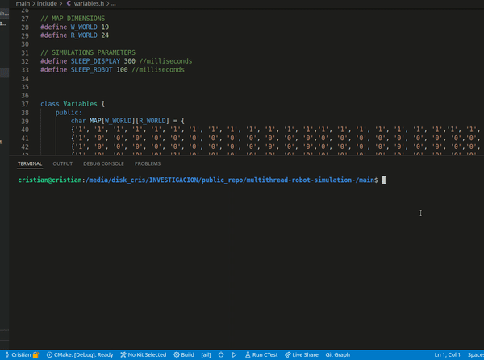
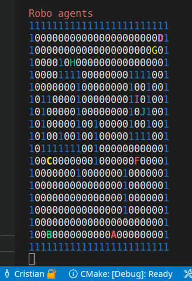

Author : Cristian Lazo Quispe

email  : mecatronico.lazo@gmail.com

## Explanation

This project consists in a simulation of robot interaction in 2D space. I have implement 3 different classes:
- Robot: It has features and 9 holonomic movements 

- World: It has a map with different obstacles

- Simulation: It take robots and a world as reference in the interaction and run multithreads of robots

    

## Code Structure

This project uses an global variables in order to have an standard of features. For example the colors and the size of the map. In addition, I create an object of robot in order to create more than one robot in the simulation in a multithread.

I use a dictionary of colors because in the display I can distinguish the movement between each robot.

    

## Setup

    Create build folder 

        $ cd main/
        $ mkdir build/
        $ cd build/

    Create executable

        $ cmake ..
        $ make

    Run simulation

        $ ./simulation_robot

    

## Results

I created 10 robots in different positions and one robot is refused because the position is unavailable

    robot_1:  origin (1, 1)   - 'A'
    robot_2:  origin (10, 10) - 'B'
    robot_3:  origin (2, 2)   - 'C'
    robot_4:  origin (6, 7)   - 'D'
    robot_5:  origin (0, 0)   - 'E'  // not available in the map
    ...
    robot_10: origin (6,19)   - 'J'

    

